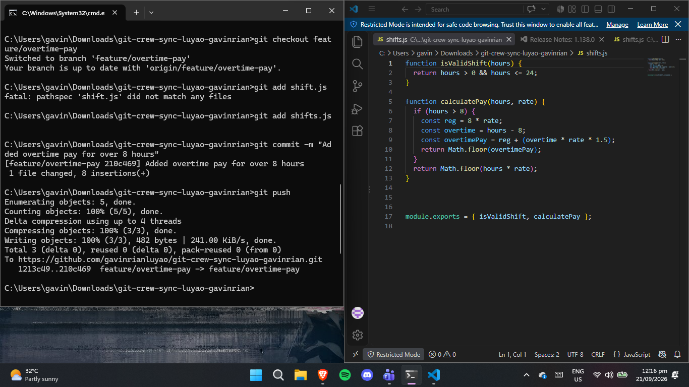
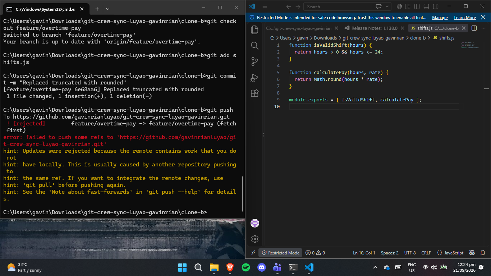
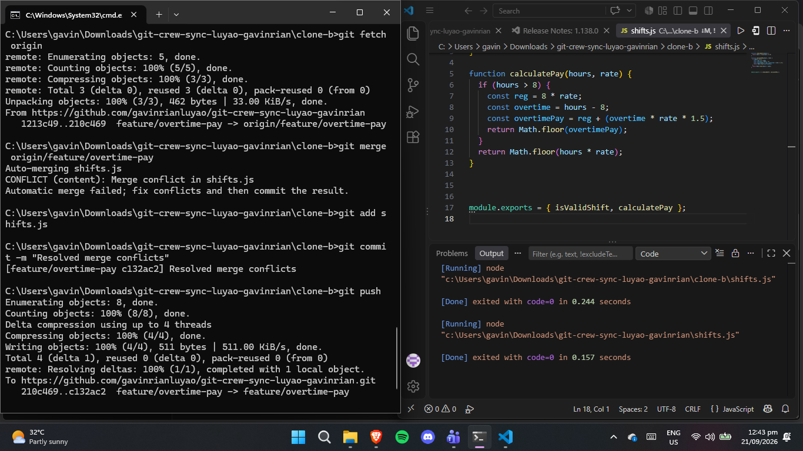
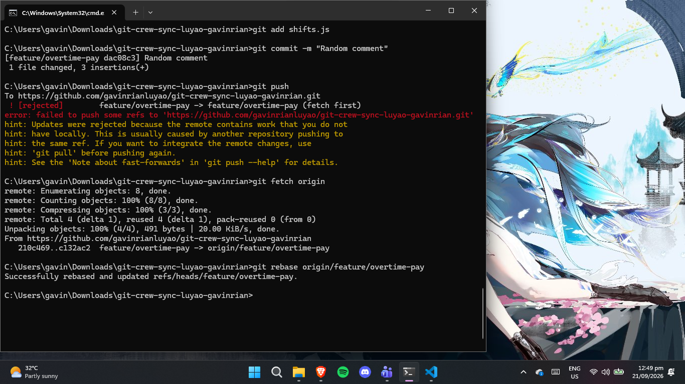
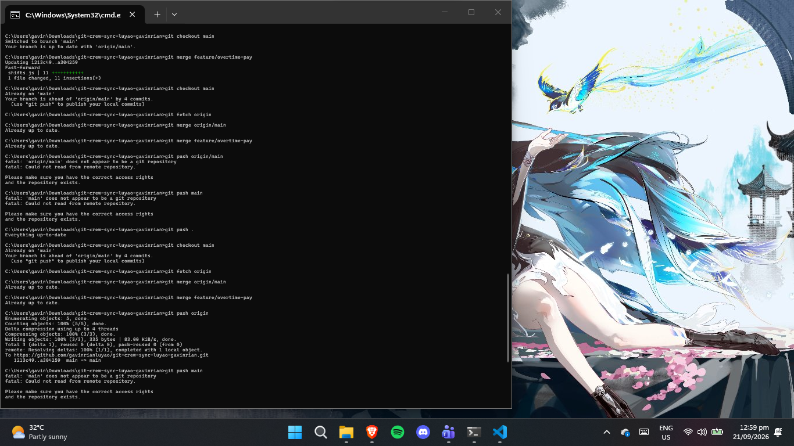
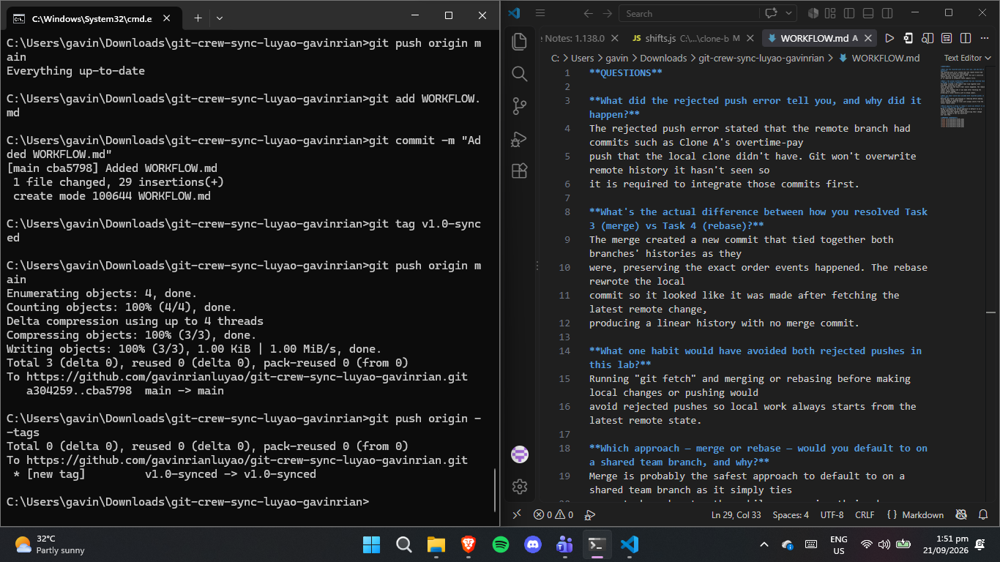

**QUESTIONS**

**What did the rejected push error tell you, and why did it happen?**
The rejected push error stated that the remote branch had commits such as Clone A's overtime-pay
push that the local clone didn't have. Git won't overwrite remote history it hasn't seen so
it is required to integrate those commits first.

**What's the actual difference between how you resolved Task 3 (merge) vs Task 4 (rebase)?**
The merge created a new commit that tied together both branches' histories as they
were, preserving the exact order events happened. The rebase rewrote the local
commit so it looked like it was made after fetching the latest remote change,
producing a linear history with no merge commit.

**What one habit would have avoided both rejected pushes in this lab?**
Running "git fetch" and merging or rebasing before making local changes or pushing would
avoid rejected pushes so local work always starts from the latest remote state.

**Which approach — merge or rebase — would you default to on a shared team branch, and why?**
Merge is probably the safest approach to default to on a shared team branch as it simply ties
separate branches together while preserving their change history, making so you can backtrack 
and view them.

**EMBEDDED SCRENSHOTS**

